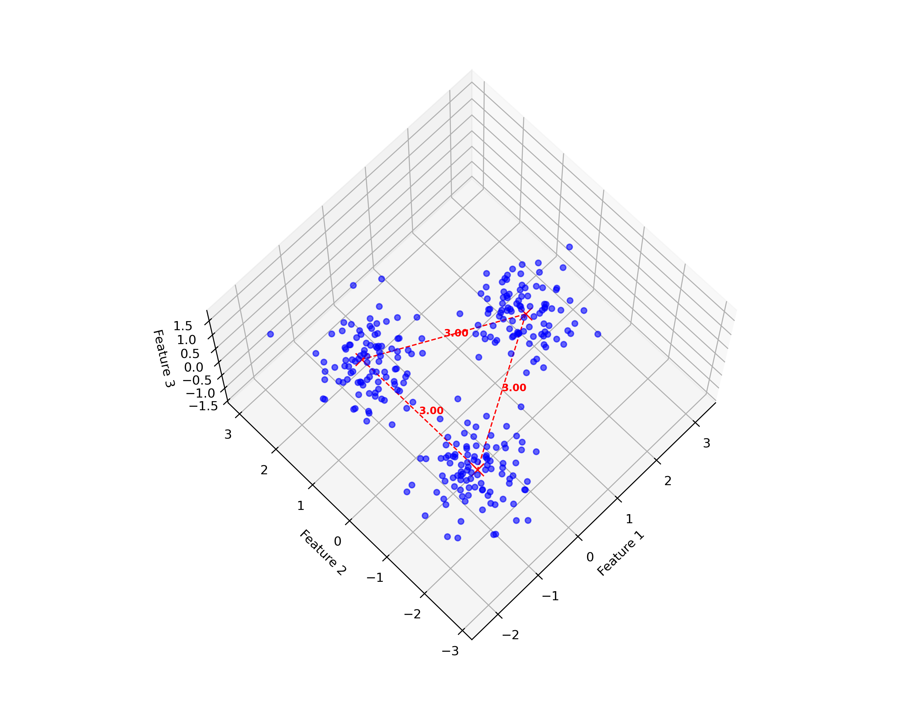
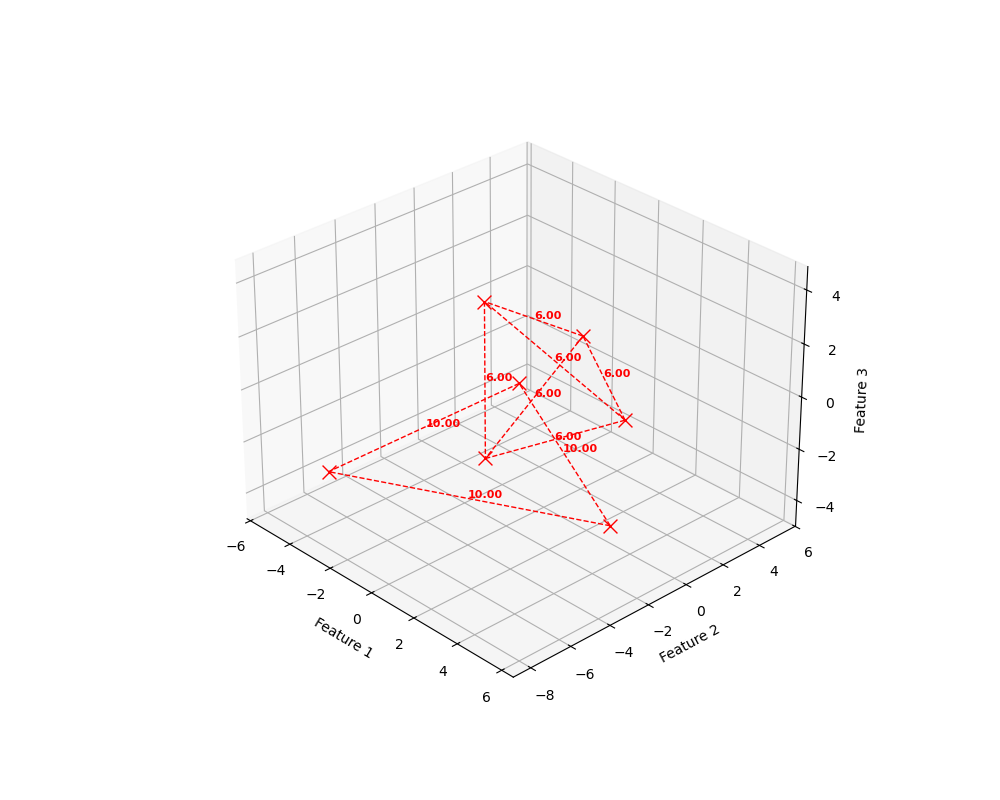

# `synthetic_multivar_tools`

The `synthetic_multivar_tools` repository is designed to help data scientists generate, explore, and visualize highly customizable synthetic multivariate data. The modules support the creation of realistic datasets with complex, hierarchical relationships. Users can iteratively build synthetic datasets by adding tailored numerical and categorical features, specifying target outcomes, and defining correlation types among features and targets. The repository offers a foundation for studying multivariate interactions in a controlled, reproducible environment.

## Real-World Applications
The `synthetic_multivar_tools` repository provides a robust framework for generating, exploring, and visualizing synthetic multivariate datasets with with known properties. These capabilities are especially relevant for real world data scenarios such as in healthcare analytics, where this repo can help support privacy-compliant data analysis and model development. In this context, key features and applications include:

- **Multilevel Modeling**:
  - Supports the analysis of patient outcomes shaped by both individual characteristics (e.g., age, comorbidities) and broader systemic factors.
  - Helps  model hierarchical relationships in healthcare data, improving accuracy in population health and informing policy decision.

- **Generative Models & Latent Variable Modeling**:
   - Create synthetic datasets with structured, realistic distributions to model complex relationships between observed and latent variables. 
   - Develop and train generative models, such as Variational Autoencoders (VAE), using synthetic datasets with well-defined structures that facilitate the learning of meaningful latent representations.
   - Simulate and explore hidden constructs (e.g., patient health profiles) that drive observed variables, providing insights into complex, underlying patterns in healthcare data.

- **Time Series and Survival Analysis**:
  - Generate synthetic datasets with well-defined time-based features and controlled patterns, enabling researchers to model patient journeys and analyze disease progression while preserving patient privacy.
  - Simulate survival outcomes by incorporating key factors, such as age, treatment types, or comorbidity impacts, to design experiments that inform proactive healthcare planning and optimize resource allocation.

- **Correlation, Stress Testing, and Sensitivity Analysis**:
  - Apply Cholesky decomposition and copulas to establish specific correlations between variables, generating realistic data scenarios to evaluate model performance under both typical and extreme conditions.
  - Perform stress testing by creating synthetic datasets that mimic healthcare system disruptions, like patient volume surges, to ensure the robustness and reliability of predictive models during critical situations.
  - Conduct sensitivity analysis with controlled data variations to pinpoint influential features, guiding strategies for targeted and effective healthcare interventions.

- **Visualizing Data in 2D and 3D**:
  - Offers tools to create clear visual representations of complex data structures, making it easier to interpret relationships between features, clusters, and hierarchical patterns.


## Key Functionalities

The repository is organized into several Python modules within the `src` directory. Each module enables the user to build a synthetic multivariate dataset by progressively adding custimized numerical and categorical features, tartget/class outcomes, and specified correlations among feature and targets:

### 1. **`hierarchical_simplex.py`**
- **Purpose**: Establishes a geometric foundation for synthetic data by defining a hierarchical simplex structure. This controls the placement of centroids, which act as anchors for subsequent steps in generating data with customizable distributions, forming organized clusters that reflect hierarchical relationships.

### 2. **`numerical_features.py`**
   - **Purpose**: Generates numerical features around predefined centroids, allowing for customizable distributions and parameters. This enables the simulation of realistic, structured data patterns.

### 3. **`categorical_features.py`**
   - **Purpose**: Adds categorical features to synthetic datasets, enabling users to simulate mixed-type data environments. This is crucial for datasets that require a combination of numerical and categorical variables.

### 4. **`correlation_features.py`**
   - **Purpose**: Introduces specified correlations between variables using Cholesky decomposition for linear dependencies and copulas for more complex relationships. This enables the creation of datasets that realistically reflect variable interdependencies, which are critical for stress testing models and understanding multivariate dynamics.


### 5. **`target_info.py`**
   - **Purpose**: Generates target variables that align with the synthetic features, supporting both classification and regression use cases. This functionality is essential for building synthetic datasets that can effectively train and validate supervised learning models.

### 6. **`figure_generator.py`**
   - **Purpose**: Offers tools for visualizing synthetic data in 2D or 3D, highlighting centroids, data clusters, and hierarchical structures. Customizable visual elements, such as connecting lines and target-based color mapping, help users interpret data distributions and validate the generation process.

## How to Use
### Setting Up the Environment
1. **Install Conda**: Ensure you have Conda installed on your system.

2. **Create the Environment**:
   ```
   conda env create -f requirements.yml
3. **Activate the Environment**:
   ```
    conda activate multivar_tools
4. **Copy code**
    ```  
    python scripts/demo_one_level_three_clusters.py
    ```
5. **Generate Two-Level Clusters**
    ```
    scripts/demo_two_level_clusters.py
    ```
    
## Example Figures
**1. A user specified geometry determines centroid placement**

**2. Same figure as above but with synthetic data specified by an optional parameterized distrbutions overlayed**

**3. A user specified geometry determines multilevel centroid placement***

**4. Same figure as above but with synthetic data specified by an optional parameterized distrbutions overlayed**


## Directory Structure
```markdown

│   .gitignore
│   requirements.yml
│
├───configs
│
├───data
│   ├───processed
│   └───raw
│
├───docs
│   README.md
│
├───results
│   ├───figures
│   │   ├───demo_three_clusters.png
│   │   ├───demo_three_clusters_no_data.png
│   │   ├───demo_two_level_clusters.png
│   │   └───demo_two_level_clusters_no_data.png
│   ├───logs
│   ├───models
│   ├───reports
│   └───tables
│
├───scripts
│   demo_one_level_three_clusters.py
│   demo_two_level_clusters.py
│
├───src
│   ├───categorical_features.py
│   ├───correlation_features.py
│   ├───figure_generator.py
│   ├───file_concatenator.py
│   ├───hierarchical_simplex.py
│   ├───numerical_features.py
│   ├───target_info.py
│   └───__init__.py
│
└───tests
    ├───test_categorical_features.py
    ├───test_correlation_features.py
    ├───test_hierarchical_simplex.py
    ├───test_numerical_features.py
    └───test_target_info.py
```
## Future Enhancements
**Mutlivariate Outcomes**: Expand to better integrate multiple targets/classes as outcomes. 
**Support for More Distributions**: Expanding the flexibility of feature and target generation.   
**Advanced Visualization**: Incorporating interactive visualizations for deeper exploration.  
**Real-World Case Studies**: Applying these techniques to anonymized healthcare datasets.

