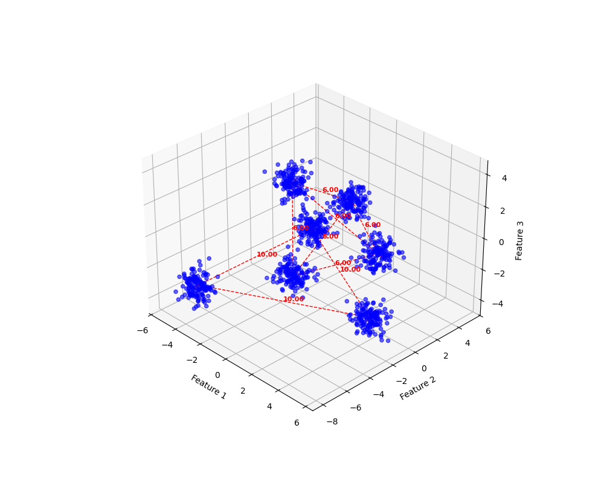

# `synthetic_multivar_tools`

The purpose of the `synthetic_multivar_tools` repository is to enable  data scientists to generate, explore, and visualize synthetic multivariate data using a known geometry to specify numerical features. The repository provides a foundation for understanding complex multivariate interactions in a controlled, reproducible environment.

## Repository Overview

### Purpose
The `synthetic_multivar_tools` repository offers a robust framework for generating synthetic datasets with known properties. These datasets are particularly useful for:
- **Understanding Multivariate Relationships**: By specifying the geometry of data clusters, users can intuitively grasp how variables interact.
- **Simulating Complex Correlations**: Through Cholesky decomposition and copulas, the repository enables realistic modeling of correlations between variables.
- **Visualizing Data in 2D and 3D**: Interactive visualizations help users explore and interpret synthetic datasets effectively.

---

## Key Functionalities

The repository is organized into several Python modules within the `src` directory, each serving a critical role in synthetic data generation:

### 1. **`hierarchical_simplex.py`**
   - **Purpose**: Defines the geometry of multivariate relationships using a hierarchical simplex. The module enables the placement of centroids (representing data clusters) in an organized, hierarchical structure.
   - **Importance**: In healthcare analytics, understanding the structure of data clusters can reveal underlying patterns, such as subgroups in patient populations.

### 2. **`numerical_features.py`**
   - **Purpose**: Generates numerical features around the centroids defined by the hierarchical simplex. Users can specify distributions (e.g., normal) and parameters (e.g., mean, standard deviation).
   - **Importance**: Provides flexibility to simulate realistic data distributions, which are crucial for testing statistical models and algorithms.

### 3. **`categorical_features.py`**
   - **Purpose**: Creates categorical features for synthetic data. This is essential when simulating datasets with both numerical and categorical variables.
   - **Importance**: In healthcare analytics, many datasets include categorical variables, such as patient demographics or diagnostic categories. This module helps replicate these conditions.

### 4. **`correlation_features.py`**
   - **Purpose**: Introduces specified correlations between variables using Cholesky decomposition and copulas. This allows for the creation of datasets with realistic interdependencies.
   - **Techniques Used**:
     - **Cholesky Decomposition**: Transforms uncorrelated data into correlated data using a specified covariance matrix.
     - **Copulas**: Enables the modeling of non-linear relationships between variables.
   - **Importance**: Simulating correlations is vital for testing models that rely on understanding variable dependencies, such as risk prediction models in healthcare.

### 5. **`target_info.py`**
   - **Purpose**: Generates target variables based on the defined features, supporting both categorical and numerical targets. Users can specify distributions and label structures for targets.
   - **Importance**: Critical for supervised learning scenarios, such as training machine learning models to predict patient outcomes.

### 6. **`figure_generator.py`**
   - **Purpose**: Visualizes synthetic data in 2D or 3D, highlighting centroids, data clusters, and inter-cluster relationships. Features include:
     - Connecting vertices with dotted lines.
     - Highlighting centroids with customizable markers.
     - Using color mapping to show target-variable relationships.
   - **Importance**: Visualization is key in healthcare analytics for communicating insights and validating data generation methods.

---

## How to Use

### Setting Up the Environment
1. **Install Conda**: Ensure you have Conda installed on your system.
2. **Create the Environment**:
   ```markdown
   conda env create -f requirements.yml
3. **Activate the Environment**:
   ```markdown
    conda activate multivar_tools
4. **Copy code**
    ```  
    python scripts/demo_one_level_three_clusters.py
    ```
5. **Generate Two-Level Clusters**
    ```
    scripts/demo_two_level_clusters.py

## Example Figures
**1. A user specified geometry determines centroid placement**

**2. Same figure as above but with synthetic data specified by an optional distrbution overlayed**

**3. A user specified geometry determines multilevel centroid placement***

**4. Same figure as above but with synthetic data specified by an optional distrbution overlayed**


## Why Use This
**Model Testing and Validation**: Synthetic datasets allow for controlled experiments, helping to evaluate model performance under various conditions. Simulate real-world healthcare data scenarios.

## Directory Structure
```markdown

│   .gitignore
│   requirements.yml
│
├───configs
│
├───data
│   ├───processed
│   └───raw
│
├───docs
│   README.md
│
├───results
│   ├───figures
│   │   ├───demo_three_clusters.png
│   │   ├───demo_three_clusters_no_data.png
│   │   ├───demo_two_level_clusters.png
│   │   └───demo_two_level_clusters_no_data.png
│   ├───logs
│   ├───models
│   ├───reports
│   └───tables
│
├───scripts
│   demo_one_level_three_clusters.py
│   demo_two_level_clusters.py
│
├───src
│   ├───categorical_features.py
│   ├───correlation_features.py
│   ├───figure_generator.py
│   ├───file_concatenator.py
│   ├───hierarchical_simplex.py
│   ├───numerical_features.py
│   ├───target_info.py
│   └───__init__.py
│
└───tests
    ├───test_categorical_features.py
    ├───test_correlation_features.py
    ├───test_hierarchical_simplex.py
    ├───test_numerical_features.py
    └───test_target_info.py
```
## Future Enhancements
**Support for More Distributions**: Expanding the flexibility of feature and target generation.  
**Mutlivariate Outcomes**: Expand to better integrate multiple targets/classes as outcomes.  
**Advanced Visualization**: Incorporating interactive visualizations for deeper exploration.  
**Real-World Case Studies**: Applying these techniques to anonymized healthcare datasets.

